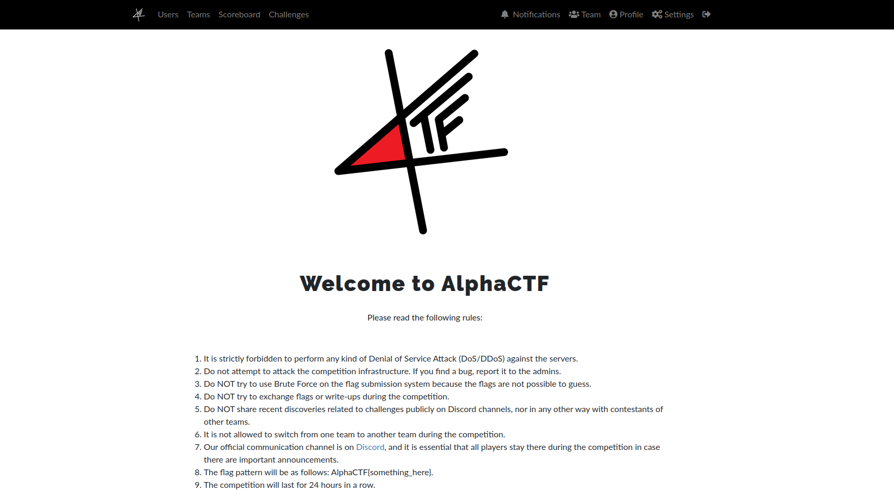

# AlphaCTF 2k23 Write-Ups

Welcome to AlphaCTF 2k23 Challenges' Write-Ups Repository, you can find all detailed solutions of each ctf's challenge.

## Introduction 

AlphaCTF 2k23 is an Algerian national event that Alphabit club offers as an opportunity to all hackers and cybersecurity enthusiasts to introduce them into cybersecurity field by organizing beginner friendly and promising workshops in different cybersecurity categories accompanied with CTF challenges to practice on.

## Content

 - [Cryptography](./cryptography/)
 - [Forensics](./forensics/)
 - [Reverse Engineering](./reverse/)
 - [Web Exploitation](./web-exploitation/)
 - [Miscellaneous](./misc/)
 - [Binary Exploitation (PWN)](./pwn/)
