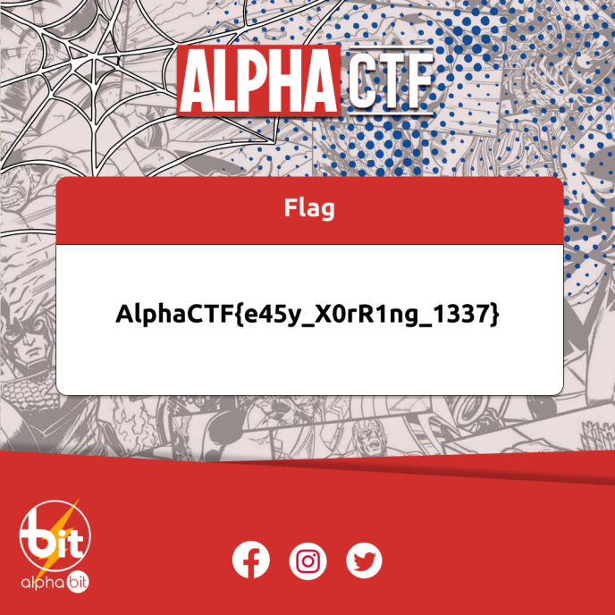

# secret_png 

## Description

> Xoring files with a secret key , was always a good way to hide data . [file](flag.png.xor)

## Write-Up

Since the flag file is xored with the key, we need to extract the key in order to decrypt the flag.

For that, we first xor the encrypted flag with the magic byte of `png` files, we can do that using this script :

```py
from pwn import xor


bytes = b""

with open("flag.png", "rb") as f:
    while (byte := f.read(1)):
        # Do stuff with byte.
        bytes += byte

magic_bytes = b"\x89\x50\x4e\x47\x0d\x0a\x1a\x0a\x00\x00\x00\x0d\x49\x48\x44\x52"

xored_bytes = xor(bytes, magic_bytes)

print(xored_bytes[:200])
```

We get :

```
b'7h15_1s_my_k3y7h\xb8e\x13\xc6~Uu\xc3Wm3t~@1+`a=8`:\x01 g\x01\xab\xd1\x05zo?/\xba\xd5\t/\xb5R\xc4\x1a3\xdf\xe5\xd0\xf4QW\x0c\x94\x14o\x96\\\x0c\xe6\xb5\t\x1d\x1c\x1e\x07ac\xde\x12=|3C\x8a\x9b_\x90\xf68^\x9e\xbd\xe0\xa2J\x1a4\xcb\x11\x8e\xa9\xdf\x01+\xa6\x9aE\x99\x94\x00E\xb0\xcch!E\x0f\xb3\x06\x88\xfc_XGIWL\xaa\x08\xc5I(\x10\xb2\x11\x14\xad\x9d#\xda\x99\xb2s\xfcX \r\xc2\xaeNv\xb9F\xc7F\xe7j:\xe0\xd0\xff5\x9c\xe4\xec\x9e<{\xe6\xc5\xb6B\xb9SJ\xc2\xca\xf3\xdb\xf6\xdb"\xc8\xa2\xc1\xc8h\x96\xf4YC\x02\x01`9\xf0\xef'
```

so the key is `7h15_1s_my_k3y`.

Now, to get the flag, we xor back the encrypted file with the key and we write the result in a new file using the following script :

```py
from pwn import xor


bytes = b""

with open("flag.png", "rb") as f:
    while (byte := f.read(1)):
        # Do stuff with byte.
        bytes += byte

key = b"7h15_1s_my_k3y"

flag_bytes = xor(bytes, key)

with open("flag_decrypted.png", "wb") as binary_file:
   
    # Write bytes to file
    binary_file.write(flag_bytes)
```

Finally, we get the decrypted image :




## Flag

AlphaCTF{e45y_X0rR1ng_1337}

## More Information

 - Magic bytes and fixed bytes for PNG : https://www.nayuki.io/page/png-file-chunk-inspector
