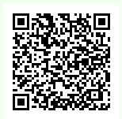

# TITLE

## Description

> I removed all the... unnecessary parts of my PNG file. Can you still display it?
> 
> NOTE: width = 154.
> 
> Filter type = 0, color type = rgb
> 
> Attachment: [Chall.bin](chall.bin)

## Tags

> PNG
> 
> IDAT


## Write-Up

As we check the [chall.bin](chall.bin) file, we can see that we have been given only the IDAT chunk of the png. To extract the data from it, we need to decompress the Zlib of it and reconstruct the picture from the result pixels, check  [img.py](img.py) :

```py
import matplotlib.pyplot as plt
import numpy as np
from PIL import Image


import zlib
import struct

with open("chall.bin", mode="rb") as file:
    contents = file.read()


splited_chunk = contents.split(b'IDAT')

# Length of data
chunk_length = int.from_bytes(splited_chunk[0], "big")

# chunck IDAT
IDAT_data = zlib.decompress(splited_chunk[1][:chunk_length])


# Set Size
width = 154
# rgb : 3 bytes per pixel
# height = idat_length / (1 + width * 3) 
height = round(len(IDAT_data) / (1 + width*3))

Recon = []
bytesPerPixel = 3
stride = width * bytesPerPixel

i = 0
for r in range(height): # for each scanline
    filter_type = IDAT_data[i] # first byte of scanline is filter type
    i += 1
    for c in range(stride): # for each byte in scanline
        # Since filter type is already given (0), so we affect directly (origin)
        Filt_x = IDAT_data[i]
        i += 1
        Recon_x = Filt_x
        Recon.append(Recon_x) # truncation to byte

# plt.imshow(np.array(Recon).reshape((height, width, 3)))
# plt.show()

# Convert the pixels into an array using numpy
array = np.array(Recon, dtype=np.uint8).reshape((height, width, 3))

# Use PIL to create an image from the new array of pixels
new_image = Image.fromarray(array)
new_image.save('flag.png')
```

From there, we get a QR to scan, that gives us the flag :




## Flag

AlphaCTF{NOw_you_Kn0W_H0w_TO_DE4l_w17H_idaT_CHUnK_aND_Zl1B_ComPrEs$i0N}

## More Information

  - PNG Chunks : http://www.libpng.org/pub/png/spec/1.2/PNG-Chunks.html
  - Magic bytes and fixed bytes for PNG : https://www.nayuki.io/page/png-file-chunk-inspector
  - Writing a (simple) PNG decoder might be easier than you think : https://pyokagan.name/blog/2019-10-14-png/
  - https://zenhack.it/challenges/2017/05/30/pngcrc.html
  - online repair : https://compress-or-die.com/repair
