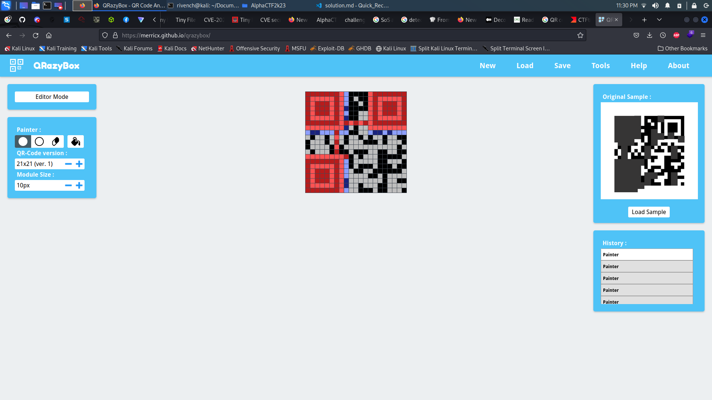

# Quick Recovery 

## Description

> In a high-security facility, there's a computer system that controls access to the most sensitive data in the world. To protect against hackers and spies, the system uses a complex encryption algorithm that changes every hour. But one day, an intruder managed to break into the facility and steal a crucial part of the algorithm. The stolen data was stored on a small device that the intruder hid somewhere in the city. To recover the data and prevent a catastrophic breach, the authorities need your help. They have intercepted a message from the intruder that contains a QR code, which they believe is a clue to the location of the device. Your mission, should you choose to accept it, is to decode the QR code and find the device before it falls into the wrong hands. But be warned, the intruder is watching your every move and will stop at nothing to keep the data hidden. Good luck!
> 
> NOTE: the flag format : AlphaCTF{Decoded_message}
> 
> Attachment: [Challenge.zip](Challenge.zip)

## Tags

> QR
>
> Recovery

## Write-Up

With this tool `QRazyBox`, you can with some analytics generate the message :

## Flag

AlphaCTF{Decoded_message}

## More Information

 - QR Code Chamestry :
   - https://ctftime.org/writeup/1648
 - Online Tool for QR Recovery : https://merricx.github.io/qrazybox/
