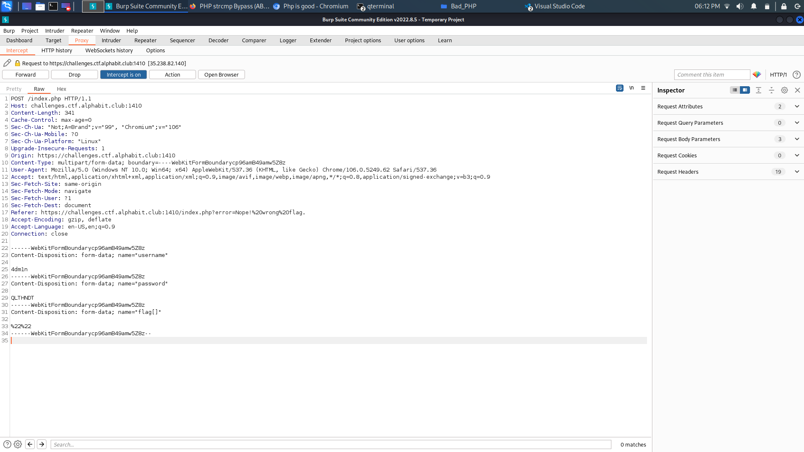

# Bad PHP

## Description

> Why everyone hating on PHP? It's a great language, it's just that people don't know how to use it properly... 
>
> https://challenges.ctf.alphabit.club:1410


## Write-Up

When we enter the page, we find that it is a regular login form except with a flag input. 

After inspecting the params, we see that there is a special route :

in this route, we find this php code :

```php
error_reporting(0);
error_log(0);

if (isset($_GET["h3lp"])) {
    highlight_file(__FILE__);
    exit;
}

if (isset($_POST["password"]) && !empty($_POST["password"]) && isset($_POST["username"]) && !empty($_POST["username"])) {
    $password = $_POST["password"];
    $username = $_POST["username"];
    if ($username == "4dm1n" && md5($password) == "0e953532678923638053842468642408") {
        if ( isset($_POST['flag']) ){
            require('flag.php');
            if ( strcmp( $_POST['flag'], $flag ) == 0 ){
                echo("You got it! That's the correct flag! <br>");
                echo("<h3>".$flag."</h3>");
                exit;
            }else{
                header("location: index.php?error=Nope! wrong flag.");
            }
        }
    } else {
        header("location: index.php?error=Incorrect password");
    }
}
```

In the first step, We have to find the value so that its md5 hash is equal to `0e953532678923638053842468642408`

We can use magic hash, because the given hash is in the form of `/^0e\d*$/`

PHP's == comparison, these types of string will be treated as float;

```php
if ($username == "4dm1n" && md5($password) == "0e953532678923638053842468642408")...
```

So if we submit any magic hash, it will be accepted if the website uses == operator.

I have used `QLTHNDT`, its hash is `0e405967825401955372549139051580`

Like that, we get :


For now we have :

```
uasername : 4dm1n
password : QLTHNDT
```

Now, it is the turn to the input `flag`.

For that, we need to checkout some vulnerabilities to bypass the `strcmp` function.

> If I set $_GET[‘flag’] equal to an empty array, then strcmp would return a NULL. Due to some inherent weaknesses in PHP’s comparisons, NULL == 0 will return true

So using **Burp Suite**, we intercept the request and tamper with it to send empty array for the flag :



**Note :** This website is using Web Kit to send requests, so we need ot be careful while tampering in the request.

Form that, we get :


## Flag

AlphaCTF{Php_iS_s0_WE1Rd_spEcI4ly_1F_YoURE_4_No0B_W17H_It}

## More Information

 - Write Up explaning magic hash : https://ctftime.org/writeup/19389
 - `strcmp` bypass : https://www.doyler.net/security-not-included/bypassing-php-strcmp-abctf2016
